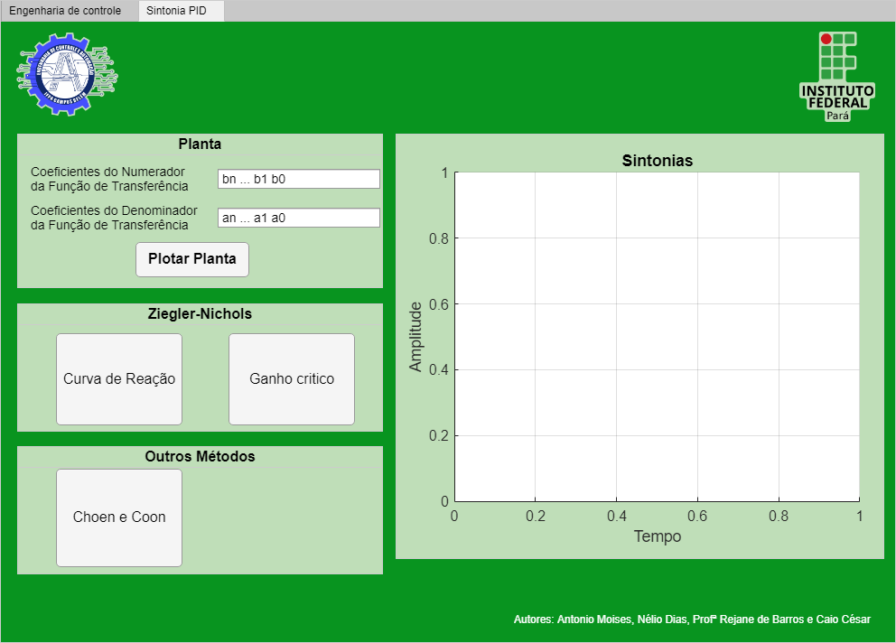
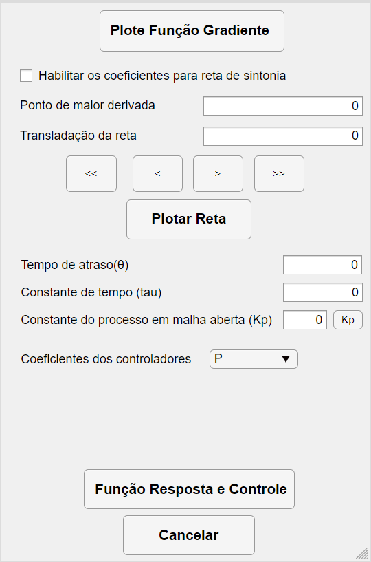
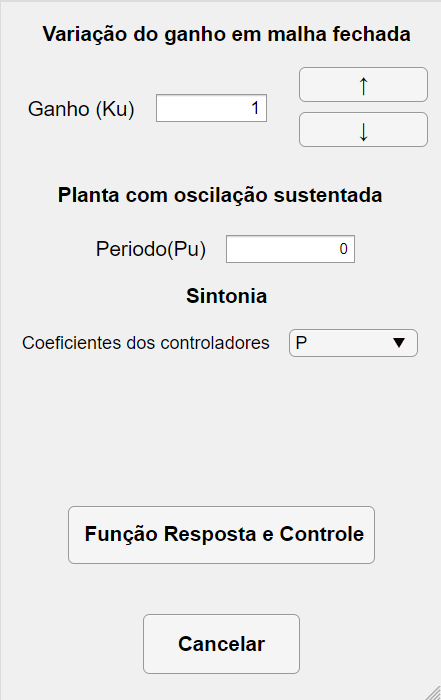
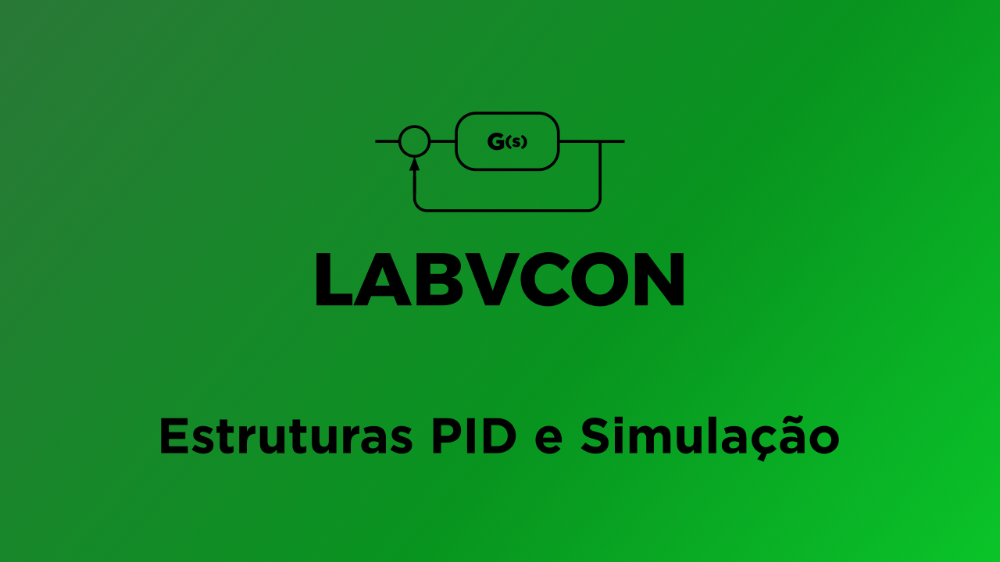

# Laboratório Virtual de Engenharia de Controle - LABVCON

Esse projeto tem como objetivo desenvolver um software que simula um laboratório de engenharia de controle clássico para um usuário que não tenha acesso aos instrumentos básicos necessários. Nesse laboratório, o usuário poderá explorar as estrututuras clássicas de PID, explorar as sintonias de PID por tabela e simular essas configurações nas funções de transferências das plantas desejadas.

## 🤝 Autores

- Antonio Moises Nascimento Araújo ([Lattes](http://lattes.cnpq.br/3944952251812665))
- Nélio Dias Santos Júnior ([Lattes](http://lattes.cnpq.br/0040496197667559))
- Profª Rejane de Barros Araújo ([Lattes](http://lattes.cnpq.br/8760830024389437))
- Caio César Silva de Carvalho ([Lattes](http://lattes.cnpq.br/0242293088447650))

(<a href="#top">back to top</a>)

## ⚙ Instalação

O softaware já é um executável, porém é necessário instalar o Matlab Runtime 2019b. O MATLAB Runtime é um conjunto autônomo de bibliotecas
compartilhadas que permite a execução de MATLAB compilado, aplicativos Simulink ou componentes. Abaixo segue o link para o download conforme seu sistema operacional.

- [Windows 64-bit](https://ssd.mathworks.com/supportfiles/downloads/R2020b/Release/7/deployment_files/installer/complete/win64/MATLAB_Runtime_R2020b_Update_7_win64.zip)
- [Linux 64-bit](https://ssd.mathworks.com/supportfiles/downloads/R2020b/Release/7/deployment_files/installer/complete/glnxa64/MATLAB_Runtime_R2020b_Update_7_glnxa64.zip)

Para mais informações, pode-se acessar a documentação do copilador nesse link: [Matlab Runtime](https://www.mathworks.com/help/compiler/matlab-runtime.html)

Feito isso, pode-se baixar o executável no botão **"Code"** na parte superior da página e em seguida clicar em **"Download Zip"**.
Pode-se baixar também nesse [link](https://github.com/jrneliodias/LABVCON/archive/refs/heads/main.zip)

(<a href="#top">back to top</a>)

## 💻 Manual de utilização

Para a utilização da primeira tela, devemos seguir a ordem numerada na figura abaixo. Temos duas interfaces no software: Estruturas PID e Sintonia PID.

### 1) Estruturas PID

   
 
  #### 1.1) Tipos de estruturas 
   Aqui você escolhe entre os tipos de estruturas clássicas disponíveis:
      
   * PID Ideal
   * PID Paralelo
   * PID Serie 
   * I+PD 
   * PI+D 
      
      
   #### 1.2) Ganhos do controlador 
   Na parte 2, devemos inserir os coeficientes Ki, Kc e Kd dos controladores na estrutura selecionada 
  
   #### 1.3) Configurações de simulação
  
   
   Após inserir os ganhos do controlador, clica-se no botão <b>Configurações de Simulação </b> e abre-se a janela ao lado. 
   
   + **Tempo de Simulação:** Insere-se o tempo total de simulação desejada.  
   + **Sinal de Referência:** Aqui configura-se quantas referências sua simulação irá conter. Pode-se escolher até 3 amplitudes de sinais e os 3 momentos que eles irão mudar.  
   + **Planta:** Aqui configura-se a função de transferência da planta do sistema. Especifica-se os polinômios do numerador e denominador
      separando-os por espaço. Exemplos:

      | Polinômio  | 
      | ------------------- | 
      |  s^2 + s + 1 | 
      | s^3 - 50*s + 2  |  
      |  (s + 1)*(s + 1) | 
      |  (s^2 + 200)*(s + 1)^3 |  

   + **Atraso:** configura-se o atraso de transporte da planta se houver. 

 

(<a href="#top">back to top</a>)

   
### 2) Sintonia PID
   
Nessa tela pode-se simular as sintonias clássicas de Ziegler-Nichols pelo ganho crítico, pela curva de reação assim como Choe e Coon nas estruturas PID da tela anterior
   
   

#### 2.1) Planta
Insere-se os coeficientes da função de transferência da planta
Para utilizá-la, devemos inserir os coeficientes da função de transferência na qual desejamos controlar na seção Planta. 

#### 2.2) Ziegler-Nichols
Escolhe-se qual metódo que será utilizado para sintonia de Ziegler-Nichols

#### 2.2.1) Ziegler-Nichols - Curva de Reação

   
   
   Selecionando o botão **Curva de Reação**, abre-se essa tela auxiliar para parametrizar  e se obter a reta tangente
   
   + **Maior t:** Slider para posicionar a parte superior da tangente
   + **Menor t:** Slider para posicionar a parte inferior da tangente

   + **Tempo de atraso (θ), constante de tempo (τ) e constante dos controladores em malha aberta (Kp):** Nesses campos, insere esses valores coletados do gráfico para calcular a sintonia.

   + **Coeficientes dos controladores:** Seleciona-se o tipo de controlador pela quantidades de componentes do PID
   

 

(<a href="#top">back to top</a>)

#### 2.2.2) Ziegler-Nichols - Ganho Crítico

   
   
   Selecionando o botão **Ganho Crítico**, abre-se essa tela auxiliar para parametrizar a curva de reação 
   
   + **Variação do ganho em malha fechada:** Aqui, controla-se Ku para que a resposta se torne uma oscilação sustentada
   
   + **Planta com oscilação sustentada:** Nessa área, deve-se coletar o período da oscilação sustentada do gráfico na tela de sintonia. Dica: o período é a distância entre duas cristas adjacentes do gráfico. Use o mouse para dar zoom, clicar e obter os valores desses pontos.
    
   + **Sintonia**  Seleciona-se o tipo de controlador pela quantidades de componentes do PID
   
   + **Função Resposta e Controle:** Depois que os campos anteriores estejam preenchidos, essa função irá gerar os coeficientes Kp, Td e Ti para se inserir nas estruturas PID.

 

(<a href="#top">back to top</a>)

#### 2.3) Outros Metódos
Opção de outros metódos de sintonia de tabela

#### 2.3.1) Metódo de Choen-Coon

O método de Choen-Coon possui como valores necessários os mesmo que o Ziegler-Nichols usando a curva de reação. Então, por esse metódo, irá abrir a mesma janela explicada no item 2.2.1 e a diferença será no algoritmo interno que usará uma tabela diferente para calcular Kp, Td e Ti

(<a href="#top">back to top</a>)

## 📽️ Exemplos - Links para o Youtube

### Exemplo 1

